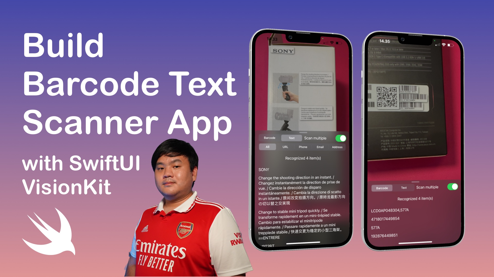

# Live Barcode & Text Scanner iOS SwiftUI App with VisionKit

## Features
- Live barcodes scan (Barcode, QR Code, Aztec, etc)
- Live text with ability to select content type (all, url, phone, address, emaail) 
- Use native Apple VisionKit framework, no need to import 3rd party dependencies

## Requierements
- Xcode 14
- iPhone with A12 Bionic CPU and later running iOS 16 

## Installation
- Build and Run using Xcode 14 and iOS 16 devices with A12 Bionic CPU and later

## YouTube Tutorial
- You can also follow the tutorial video at [XCA YouTube Channel](https://youtu.be/QQjLOlkxpvc)